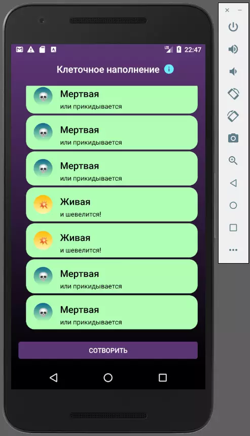

**Клеточное наполнение**
===========================
Вы делаете приложение для демиурга Шамбамбукли.  
Создавая новый мир, он наполняет его клетками. Каждый раз, нажимая на кнопку в приложении, в список клеток добавляется новая:
* равновероятно она может быть как живой, так и мёртвой;
* жизнь зарождается, если до этого трижды подряд создалась живая клетка;
* если трижды подряд родилась мёртвая клетка, жизнь рядом умирает. 

Изначально список клеток пуст. 
Можно пользоваться сторонними библиотеками, например — Picasso, Glide.
Не нужно делать release-сборку, code shrinking, proguard, подписи для apk и выкладывать play store.

